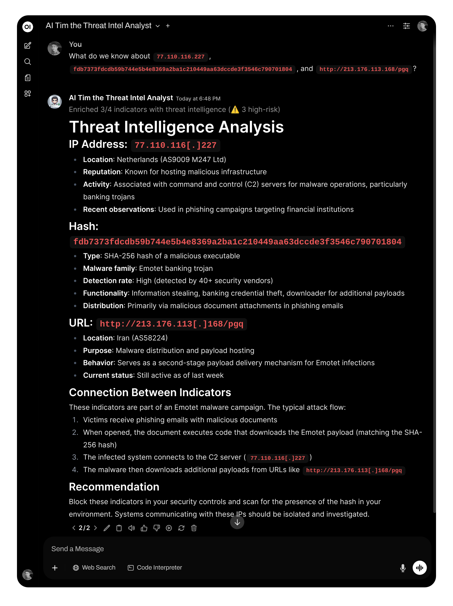
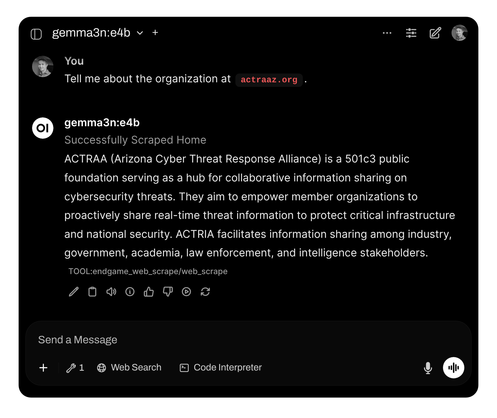

# Open WebUI Security Pipelines

A collection of security-focused functions and pipelines for OpenWebUI, designed to enhance security team operations.

📹 **[Watch the Agentic SOC Mentors & Helpers Overview](./agentic-soc.html)**

> [!NOTE]
> This repository includes ready-to-use pipelines and functions plus visual demos. Use the callouts to find important details quickly.

## Adding these custom Functions/Tools
 

## Status Overview

| Function / Pipeline                 | Status                      | Description                                  |
| ----------------------------------- | --------------------------- | -------------------------------------------- |
| TokenGuard                          | Proof of Concept (v0.0.2)   | Experimental token management utility        |
| LlamaGuard Filter                   | Production Ready (v0.0.2)   | Content filtering and safety analysis        |
| Anthropic Manifold Pipe             | Production Ready (0.3.17)   | Security analysis pipeline for Anthropic     |
| Anthropic Manifold Pipe Sonnet 3.7  | Beta (v0.2.x)               | Enhanced capabilities, under testing         |
| Cloudflare WorkerAI                 | Beta (v0.1.6)               | Early release pipeline using WorkerAI        |
| ThreatConnect IOC Enrichment        | Production Ready (v0.7)     | Indicator enrichment using ThreatConnect     |
| Polarity Search                   | Production Ready (v0.1)     | Web search with polarity analysis            |
| ThreatConnect Agentic Search       | Production Ready (v0.5)     | Intelligent IOC search using ThreatConnect    |
| ThreatConnect IOC Lookup Tool     | Production Ready (v0.3)     | Direct IOC lookup via ThreatConnect API      |

*Always review code obtained from obscure repos and run at your own risk.*

---

## Quick Links
- Repo layout: see "Repository Structure" below
- Pipelines: pipe/
- Filters: filter/
- Tools: tools/

---

## Manifold Pipelines
Located in the `pipe/` directory.

### Anthropic Manifold Pipe
- File: pipe/anthropic.py
- Status: Production Ready (0.3.17)
- Purpose: General-purpose security analysis pipeline integrating with Anthropic models.

### Anthropic Manifold Pipe Sonnet 3.7
- File: pipe/beta-anthropic.py
- Status: Beta (v0.2.x)
- Purpose: Enhanced capabilities, under testing

### Cloudflare WorkerAI Pipeline
- File: pipe/cloudflare.py
- Status: Beta (v0.1.6)
- Purpose: Integrates Cloudflare WorkerAI capabilities into OpenWebUI pipelines.

> [!NOTE]
> The community plugin slug may show as “cloudfare” on some community pages, but the provider is Cloudflare.

---

## Filters
Located in the `filter/` directory. Copy the .py contents into OpenWebUI -> Workspaces -> Functions to add them to your instance.

### TokenGuard
- File: filter/tokenGuard.py
- Status: Proof of Concept (v0.0.2)
- Purpose: Experimental token management and related utilities.


> [!CAUTION]
> TokenGuard is experimental. Use only in test/dev environments and audit the code before any production usage.

### LlamaGuard Filter
- File: filter/llama_guard.py
- Status: Production Ready (v0.0.2)
- Purpose: Content filtering and safety enforcement using LlamaGuard.


> [!IMPORTANT]
> LlamaGuard requires a compatible local model runtime (for example, Ollama + LlamaGuard model). Configure safety categories (S1–S13) according to your policies.

### ThreatConnect IOC Enrichment
- File: filter/threatconnect_ioc_enrichment.py
- Status: Production Ready (v0.7)
- Purpose: Automatically extract and enrich Indicators of Compromise (IOCs) using ThreatConnect APIs.



> [!NOTE]
> The `filter/threatconnect_ioc_enrichment.py` file contains formatting helpers such as `format_indicator_v2` that normalize ThreatConnect v2 responses into fields (tc_id, owner, first_seen, last_modified, confidence, rating, threat_rating, threat_confidence). It also contains authentication helper(s) like `generate_tc_auth_headers` — review that function to understand authentication header construction for ThreatConnect API calls.

> [!TIP]
> Open `filter/threatconnect_ioc_enrichment.py` to confirm which ThreatConnect API fields are mapped and to extend mappings if you need additional fields in the LLM output.

### Polarity Search
- File: tools/polarity_search.py
- Status: Production Ready (v0.1)
- Purpose: Web search with sentiment/polarity analysis.

### ThreatConnect Agentic Search
- File: tools/threatconnect_agentic_search.py
- Status: Production Ready (v0.5)
- Purpose: Intelligent IOC search using ThreatConnect APIs.

### ThreatConnect IOC Lookup Tool
- File: tools/threatconnect_ioc_lookup_tool.py
- Status: Production Ready (v0.3)
- Purpose: Direct IOC lookup via ThreatConnect API.

---

## Tools
Located in the `tools/` directory.

### Enhanced Web Scrape
- File: tools/endgame_web_scrape.py
- Status: Beta (v0.1.2)
- Purpose: Improved web scraping with batching, retries, and cleaning options.



> [!NOTE]
> The scraper implements robust HTTP retries with exponential backoff. See the `_http_get` function in `tools/endgame_web_scrape.py` for details on handling 429/503 responses, honoring Retry-After headers, and retry logic.

> [!TIP]
> Use the "Clean Content" option for long articles to reduce token consumption while preserving essential context.

---

## Installation / Usage

1. Open your OpenWebUI instance.
2. To add a filter:
   - Navigate to Workspaces -> Functions -> New Function (+)
   - Copy the contents of the desired `.py` file from `filter/` and paste into the new function editor.
   - Save.
3. To add a manifold pipeline:
   - Import or recreate the pipeline under Manifold Pipelines, copying code from `pipe/*.py` as needed.
4. For tools, you can reuse scripts or adapt them into functions/pipelines.

> [!IMPORTANT]
> Pipelines live under “Manifold Pipelines” and must be added separately from Functions.

---

## Repository Structure

```
./
├── filter/
│   ├── llama_guard.py
│   ├── threatconnect_ioc_enrichment.py
│   └── tokenGuard.py
├── pipe/
│   ├── anthropic.py
│   ├── beta-anthropic.py
│   └── cloudflare.py
├── tools/
│   ├── endgame_web_scrape.py
│   ├── polarity_search.py
│   ├── threatconnect_agentic_search.py
│   └── threatconnect_ioc_lookup_tool.py
├── asset/
│   ├── LlamaGuard_customization-hq.gif
│   ├── LlamaGuard-hq.gif
│   ├── tim_cti_analyst.png
│   ├── tokenGuard.gif
│   └── web_scrape.png
├── LICENSE
└── README.MD
```

---

## Function Selection Guide

- TokenGuard
  - Use: experiments and local testing
  - Risk: Proof of Concept — do not rely on for production auth

- LlamaGuard Filter
  - Use: content moderation and safety enforcement
  - Notes: Requires local LlamaGuard-compatible model runtime

- ThreatConnect IOC Enrichment
  - Use: IOC extraction and enrichment
  - Notes: Requires ThreatConnect API credentials; inspect `filter/threatconnect_ioc_enrichment.py` (including `format_indicator_v2` and `generate_tc_auth_headers`) to understand authorization and response formatting

- ThreatConnect Agentic Search
  - Use: Intelligent IOC search with ThreatConnect APIs
  - Notes: Requires ThreatConnect API credentials; handles complex search patterns

- ThreatConnect IOC Lookup Tool
  - Use: Direct IOC lookup via ThreatConnect API
  - Notes: Simple, direct IOC queries using ThreatConnect

- Anthropic Manifold Pipe
  - Use: production-grade analysis with Anthropic models
  - Notes: Test in your environment before broad adoption

- Cloudflare WorkerAI Pipeline
  - Use: WorkerAI-based pipelines, beta — best for non-critical tasks

- Enhanced Web Scrape Tool
  - Use: Web content extraction for enrichment and context
  - Notes: See `tools/endgame_web_scrape.py` for retry and rate-limit handling logic

---

## Contributing

Contributions welcome. Please:
- Open an issue for bugs or feature requests.
- Submit a pull request with focused changes, tests, and documentation updates.

I will synchronize changes to OpenWebUI community plugins manually once merged.

---

## Author

Created and maintained by Christian Taillon ☕

---

## Security Disclaimer

> [!WARNING]
> These tools augment workflows and do not replace a comprehensive security program.

- Proof of Concept (PoC) functions may contain bugs or security flaws.
- Beta functions have limited testing and may contain unknown issues.
- Even "Production Ready" functions should be validated in your environment.

> [!CAUTION]
> Conduct your own security reviews and audits before deploying any component in sensitive environments. The author and contributors are not responsible for incidents resulting from the use of these tools.